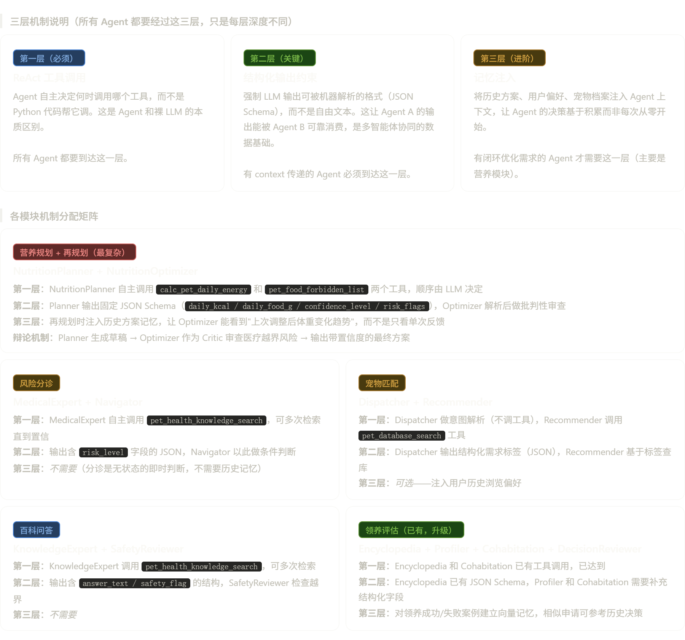

好问题。答案是多种机制并存，但不是所有 Agent 都用同一套——不同业务场景适合不同机制的组合。我给你设计一个"机制分配矩阵"，说清楚每个模块该用哪几种机制叠加，以及具体操作步骤。

核心思路：三层机制叠加
先看整体设计逻辑：
 

具体实现方案：按模块逐一拆解
模块一：营养规划（三层全用，最复杂）
第一层——让工具调用真正由 LLM 驱动：
nutrition_expert.py 里已经注册了 calc_pet_daily_energy 和 pet_food_forbidden_list 两个工具，但现在没有 Agent 真正去调用它们。改造方向是把 NutritionPlanner Agent 的 Task description 写成"你收到宠物信息，先调用能量计算工具获取热量数据，再调用禁忌清单工具获取禁忌食物，最后整合输出方案"。关键是不要在 description 里把答案提前给它，让 LLM 自己决定调用顺序和次数，verbose=True 的日志里应该出现多次 Action 和 Observation 交替。
第二层——结构化输出：
NutritionPlanner 的 expected_output 里要定义一个 JSON Schema，包含以下强制字段：daily_kcal、daily_food_g、confidence_level（0-1 的浮点数）、risk_flags（字符串数组）、requires_vet（布尔值）。这样 NutritionOptimizer 拿到 context 时，可以直接解析 confidence_level 和 risk_flags，做针对性批评，而不是从大段文字里猜。
第三层——记忆注入（营养再规划专用）：
这是你项目里最有价值的记忆应用场景。具体实现分两步：
第一步，在 SQLite 的 nutrition_plans 表里已经有历史方案记录，再规划时把该宠物最近 3 次方案的关键字段（daily_kcal 变化趋势、对应的 feedback.weight_change）提取出来，作为文本片段拼入 NutritionOptimizer 的 Task description 里。这是"手动记忆注入"，不需要引入 CrewAI Memory API，用你现有的数据库就够。
第二步（进阶），在 Crew 初始化时加 memory=True，CrewAI 会自动开启短期记忆，记住本次 Crew 执行过程中各工具的调用结果，避免重复检索同一个禁忌食物列表。
辩论机制（再规划场景）：
NutritionOptimizer 的 backstory 要写成"你是一名持怀疑态度的营养师，你的任务是审查 Planner 的方案，专门挑出以下问题：热量调整幅度是否超过 20%（过激）、是否忽视了 risk_flags 里的警告、置信度是否和实际反馈严重性相符"。它的 Task 接收 Planner 的结构化 JSON 作为 context，输出一份"批改报告"，包含是否接受原方案、修改了哪些字段、最终置信度是多少。这时 confidence_level 就不再是硬编码的 0.7 或 0.98，而是 Critic Agent 真实推理的结果。

模块二：风险分诊（前两层，第三层不需要）
第一层——多轮检索：
MedicalExpert 现在的 max_iter 没有设置，默认值足够，但 backstory 里需要加一条明确的自我修正指令："如果首次检索结果的相关度不足（知识库返回了'未检索到匹配结果'），必须换一个更简短的关键词重新检索，最多尝试两次"。这样 Agent 会在 ReAct 循环中真正走两到三轮工具调用，而不是检索一次就草草输出。
第二层——结构化输出供 Navigator 消费：
这是分诊模块目前最大的痛点。现在 MedicalExpert 输出的是自由文本，Navigator 要靠字符串匹配来判断是否需要导航，非常脆弱。
改造方法：在 MedicalExpert 的 expected_output 里要求输出一个 JSON 对象，包含三个字段：risk_level（枚举值：Low/Medium/High/Emergency）、diagnosis_summary（文本摘要）、need_navigation（布尔值）。
NavigatorAgent 的 Task description 里写明："你将收到上一个 Agent 的 JSON 格式分诊报告作为 context。当且仅当 need_navigation 为 true 或 risk_level 为 Emergency 时，你才调用 nearby_hospital_search 工具；其他情况直接输出居家护理建议，不需要调用工具"。
这就把"条件触发"的判断权从 Python 代码层移到了 LLM 层，Agent 自己决定是否需要导航。

模块三：宠物匹配（前两层）
第一层——职责分工明确化：
Dispatcher Agent 不应该有任何工具，它的唯一职责是"自然语言理解"，把用户输入解析成结构化标签。Recommender Agent 持有 pet_database_search 工具，它的 ReAct 循环里应该出现这样的推理："我收到了需求标签：安静、不掉毛、小型。我调用数据库搜索→返回 3 条结果→判断是否满足所有条件→有一条掉毛严重不符合→我换关键词再搜索一次"。
也就是说，Recommender 的 max_iter 应该设置为 5，允许它在数据库里反复尝试不同关键词，直到找到真正符合要求的结果或确认无符合项。
第二层——Dispatcher 的输出即 Recommender 的 context：
Dispatcher 的 expected_output 要求输出 JSON：{ "keywords": ["安静", "小型"], "deal_breakers": ["掉毛严重"], "user_situation": "小公寓,独居" }。这个结构体直接作为 Recommender 的 Task context，Recommender 的描述里明确说"基于 context 中的 keywords 搜索，并用 deal_breakers 过滤掉不合适的结果"。

模块四：百科问答（前两层）
第一层——替换内联 Agent，给工具：
把 run_knowledge_expert 里临时内联的 Agent(role='百科百事通', goal='提供建议') 完全删掉，替换为调用 adoption_profiler.py 里已有的 get_encyclopedia_agent(llm) 函数。这个 Agent 已经注册了 pet_health_knowledge_search 工具，一行改动就能让问答走 RAG 检索而不是裸 LLM。
第二层——加 SafetyReviewer：
新增一个极轻量的 SafetyReviewer Agent，不需要任何工具，它只做一件事：检查上一个 Agent 的输出是否包含"确诊"、"服用 X mg"、"手术"等医疗越界表达，如有则替换成"建议就医确认"类措辞，同时在输出中加一个 safety_modified: true/false 字段。
这个 Agent 的价值不只是安全，在论文里可以作为"AI 输出可信度保障机制"单独成一节描述，是个值得写的创新点。

三层机制实施顺序建议
不要同时改所有东西，按以下顺序推进：
第一周：全面完成第一层（ReAct 工具调用）
逐个 Agent 打开 verbose=True，跑一个测试用例，看日志里工具调用次数。目标是每个有工具的 Agent 都能看到至少 2 次 Action: [tool_name] 出现在日志里。如果只有 1 次，说明 backstory 描述不够充分，需要加"如果首次结果不满意，换关键词重试"的指令。
第二周：完成第二层（结构化输出）
重点是分诊和营养两个模块。先改 MedicalExpert 的 expected_output 加 risk_level JSON 字段，验证 NavigatorAgent 能通过 context 可靠读取。再改 NutritionPlanner 的输出 Schema，验证 NutritionOptimizer 能基于结构化数据做批评而不是读文本。
第三周：完成第三层（记忆注入），仅营养模块
先做"手动记忆注入"——从数据库提取历史方案趋势拼入 context，这不需要任何新依赖。验证再规划结果确实引用了历史数据（可以在输出里加一个 referenced_history: [plan_id_list] 字段来验证）。如果时间允许，再试 Crew(memory=True) 的短期记忆。
这样三周下来，你的项目从"5 个单 Agent 伪装 + 1 个真协同"变成"5 条业务链路全部真正有 ReAct 推理 + 结构化数据流动 + 1 个带记忆的闭环优化"，答辩时日志截图就是最好的证明。