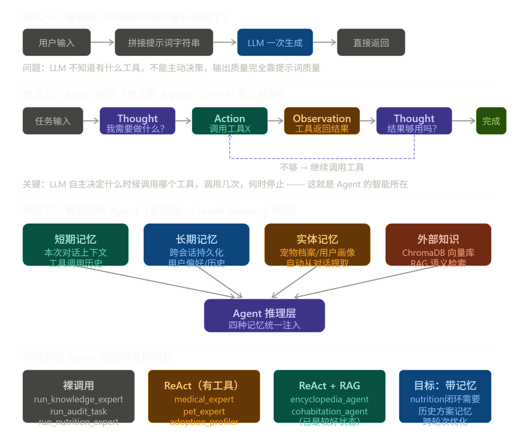

这个问题问到核心了。你目前大部分 Agent 本质上只是"把问题交给 LLM 说一遍"，和真正的 Agent 差距很大。让我从机制层面说清楚区别，再对应到你的每个文件。

先搞清楚：什么叫"真正与大模型结合"
"简单调用 API + 提示词"和"真正的 Agent"的本质区别，在于推理循环的控制权在谁手上。

五种让 Agent 真正与大模型结合的机制
机制一：ReAct 工具调用循环（最核心）
这是 CrewAI 的默认执行机制，但你的大多数 Agent 有工具却没真正用起来。
真正的 ReAct 循环里，LLM 每一步都在做自主推理：

"我拿到了症状描述，我觉得需要先检索知识库→调用 pet_health_knowledge_search→拿到结果→判断是否足够→不够再检索→够了再输出"

判断你的 Agent 是否真正走 ReAct 的方法：把 verbose=True 打开，跑一次，看日志里有没有 Thought:、Action:、Observation: 这三行交替出现。如果只有一次 Action 就结束，说明 Agent 没有在真正推理，只是走了一遍工具调用。
你现在有几个 Agent 已经注册了工具（medical_expert、pet_expert、encyclopedia_agent），但工具的使用深度不够，原因通常是 max_iter 设的太低（默认是 5，有的地方设了 2），LLM 还没有机会反复推理就被截断了。

机制二：结构化输出 + 格式约束
这是让 LLM 输出"可被下一个 Agent 消费"而不是"只能给人看"的关键。
你的 encyclopedia_agent 已经做得很好：backstory 里要求输出 JSON 结构，包含 space_requirement、exercise_level 等固定字段。这个字段后续 adoption_profiler_agent 能直接引用。
但你其他 Agent 几乎没有这个设计：

run_triage_expert 的输出是一段 markdown 文本，navigator 无法从里面可靠地提取"风险等级是否为 Emergency"，只能靠字符串匹配
run_knowledge_expert 的输出完全没有结构，下游无法使用

改进方向：每个 Agent 的 expected_output 和 backstory 里，都要定义一个 LLM 必须遵守的输出 Schema。例如分诊 Agent 要求输出包含 risk_level: Low|Medium|High|Emergency 字段，这样 NavigatorAgent 的 context 里就能可靠地做条件判断，而不是靠关键词搜索。

机制三：记忆注入（Memory）
CrewAI 提供了四种记忆类型，你的项目一种都没用，这是最大的空白：
短期记忆（Short-term Memory）：Agent 在一次任务执行过程中，记住自己调用过哪些工具、得到过什么结论，避免重复调用同一个工具。开启方式是在 Crew 初始化时加 memory=True。
长期记忆（Long-term Memory）：跨次会话的持久化记忆，基于向量存储。对你的营养再规划场景价值极高——Agent 能记住"上次这只猫调低热量之后体重反而下降了"，这才是真正的闭环学习。
实体记忆（Entity Memory）：Agent 自动从对话中提取关键实体（猫咪名字、品种、历史病症）并持久化，下次对话时自动注入上下文。对你的用户画像和宠物档案场景非常适合。
你项目里 ChromaDB 已经存在，而 CrewAI 的长期记忆恰好也可以配置为使用 ChromaDB 作为后端，两者可以复用同一个基础设施，不需要额外引入新依赖。

机制四：规划与任务分解（Planning）
CrewAI 有一个 planning=True 的 Crew 级开关，开启后会在任务执行之前，先让一个"规划 LLM"分析整个任务并制定执行计划，然后再按计划调度各 Agent。
这个机制对你的领养评估场景特别有价值：现在三个 Agent 的顺序是硬编码的（百科→画像→共处），而 Planning 模式下 LLM 可以根据具体情况动态调整——比如当申请人已有 10 年养宠经验时，规划器可能判断百科 Baseline 不需要深度检索，直接跳过工具调用，节省时延。
对你的毕设来说，这是一个可以在论文里作为设计亮点描述的机制，而且只需要在 Crew() 初始化里加一个参数就能开启。

机制五：反思与自我修正（Reflection via max_iter）
这是 ReAct 循环的高级形态：Agent 对自己上一步的输出进行批判性审查，决定是否需要重来。
在你的代码里，pet_expert.py 已经设置了 max_iter=3，这就是给 LLM 三次自我修正的机会。但 adoption_profiler 设的是 max_iter=3 而 encyclopedia_agent 只有 max_iter=2，而 medical_expert 和 navigator 都没有设，默认值是 15（CrewAI 新版），这意味着分诊专家理论上可以反复检索知识库直到满意，但你从来没在日志里观察过它实际走了几轮。
改进方向：为不同类型的 Agent 设计合理的 max_iter——高风险决策型（分诊、领养评估）设高一些（5-8），纯检索型（百科查询）设低一些（2-3），避免既不够用又浪费 API 调用次数。

对应到你每个文件的具体改造方向
Agent 文件当前缺失的机制最优先补充的一个nutrition_expert.py工具调用链、结构化输出、记忆让 Agent 真正调用 calc_pet_daily_energy 工具（而不是 Python 直接调），并要求 JSON 格式输出medical_expert.py结构化输出、max_iter 调优要求 expected_output 包含 risk_level 字段，让 NavigatorAgent 能可靠读取navigator.py条件判断、结构化输入消费backstory 里明确说明"当 context 中 risk_level 为 High/Emergency 时才调用工具"pet_expert.py记忆、多轮检索max_iter 从 3 调到 5，backstory 加"若首次检索无结果，换关键词重试"audit_expert.py结构化输出、规则结果注入把 rule_engine_prescreen 的结果作为 context 传入，让 Agent 在规则基础上做语义深化而不是从零开始adoption_profiler.py 里的三个 Agent已经较好，可加记忆开启 Crew(memory=True)，让百科检索结果在跨次评估中被记住，避免
最重要的一点
你现在的 run_knowledge_expert 里那个临时 Agent 之所以只是"裸调用"，根本原因是没有工具。一个没有任何工具的 Agent，无论 backstory 写得多好，LLM 只能一次性输出，没有 ReAct 循环可走。
Agent = LLM + 工具 + 循环推理，三者缺一不可。工具是 Agent 的"手"，记忆是 Agent 的"经验"，ReAct 循环是 Agent 的"思考过程"。你项目里工具其实已经写好了（tools.py 里有 6 个工具），关键是要把它们分配到正确的 Agent 上，并让 verbose=True 的日志证明 LLM 在自主决定调用它们，而不是 Python 代码在帮它调用。